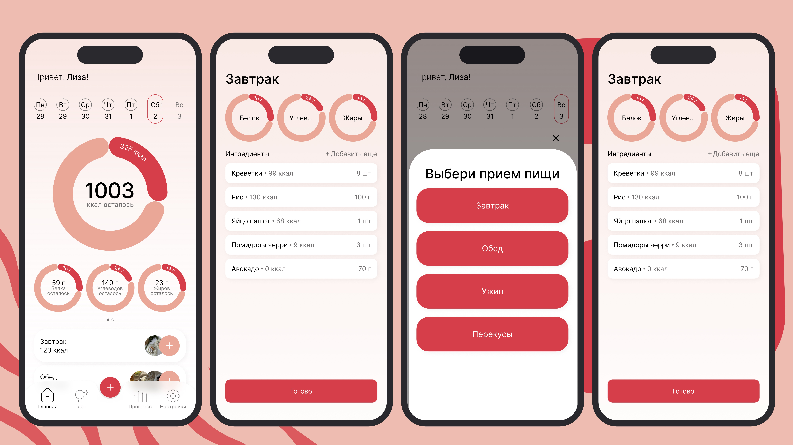

# 🍎 CalorAI Mobile

<div align="center">
  
  
  <h3>Современное Android приложение для отслеживания питания и калорий</h3>
  
  
</div>

---

## 📱 О проекте

CalorAI Mobile — это красивое и функциональное приложение для ведения дневника питания, отслеживания калорий и достижения ваших целей в области здоровья. Приложение построено с использованием современных Android технологий и следует лучшим практикам разработки.

## ✨ Основные возможности

### 🔐 Авторизация
- Регистрация новых пользователей
- Вход в систему
- Безопасное хранение токенов доступа
- Автоматическое обновление токенов

### 🏠 Главный экран
- Просмотр питания за выбранный день
- Интерактивный недельный бар для навигации по датам
- Визуализация макронутриентов через pie-чарты
- Карточки приемов пищи (завтрак, обед, ужин, перекусы)
- Быстрое добавление продуктов и блюд

### 🍽️ Управление питанием
- Создание записей о приеме пищи вручную
- Детальный просмотр информации о блюде
- Отслеживание калорий и БЖУ (белки, жиры, углеводы)

### 📊 Прогресс
- Отслеживание прогресса по достижению целей
- Визуализация статистики питания

### 📋 План
- Настройка плана питания
- Выбор уровня активности
- Выбор целей в области здоровья

### 👤 Профиль
- Просмотр и редактирование профиля пользователя
- Настройка личных данных
- Управление параметрами здоровья

## 🏗️ Архитектура

Приложение построено на принципах **Clean Architecture** с использованием паттерна **MVVM** (Model-View-ViewModel).

### Структура проекта

```
app/src/main/java/dev/calorai/mobile/
├── core/                    # Общие модули
│   ├── di/                 # Dependency Injection (Koin)
│   ├── local/              # Локальная база данных (Room)
│   ├── navigation/         # Система навигации (Custom Router)
│   ├── network/            # Сетевой слой (Retrofit)
│   ├── uikit/              # Переиспользуемые UI компоненты
│   └── utils/              # Утилиты
│
├── features/               # Функциональные модули
│   ├── auth/              # Авторизация
│   │   ├── data/          # API, DTO, Token Management
│   │   ├── domain/        # Use Cases
│   │   ├── login/         # UI экрана входа
│   │   └── signUp/        # UI экрана регистрации
│   │
│   ├── home/              # Главный экран
│   ├── main/              # Основной навигационный граф
│   ├── meal/              # Управление питанием
│   ├── plan/              # Планирование
│   ├── profile/           # Профиль пользователя
│   ├── progress/          # Прогресс
│   └── splash/            # Экран загрузки
│
└── di/                    # Главный модуль DI
```

### Архитектурные слои

Каждый feature модуль разделен на три слоя:

1. **Data Layer**
   - API интерфейсы (Retrofit)
   - DTO модели
   - Repository реализации
   - DAO для Room

2. **Domain Layer**
   - Use Cases
   - Domain модели
   - Repository интерфейсы
   - Бизнес-логика

3. **UI Layer**
   - ViewModels
   - Compose экраны
   - UI State и Events

### Навигация

Приложение использует кастомную систему навигации на основе **Navigation Compose**:

- **GlobalRouterContext** — для глобальной навигации между основными экранами
- **MainRouterContext** — для навигации внутри главного экрана с bottom navigation
- Типобезопасная навигация через sealed классы

## 🛠️ Технологический стек

### Основные технологии

| Категория | Технологии |
|-----------|-----------|
| **Язык** | Kotlin |
| **UI Framework** | Jetpack Compose |
| **Архитектура** | Clean Architecture + MVVM |
| **DI** | Koin |
| **Навигация** | Navigation Compose + Custom Router |
| **Сетевое взаимодействие** | Retrofit 3.0 |
| **Сериализация** | Kotlinx Serialization |
| **Локальная БД** | Room |
| **Асинхронность** | Kotlin Coroutines & Flow |
| **Загрузка изображений** | Coil |
| **Дизайн** | Material 3 |
| **Безопасность** | AndroidX Security Crypto |

### Версии

- **Min SDK**: 26 (Android 8.0)
- **Target SDK**: 36
- **Compile SDK**: 36
- **Kotlin**: 2.2.21
- **Compose BOM**: 2025.11.00
- **Gradle**: 8.13.0

## 🎨 Дизайн

Приложение использует **Material 3** дизайн-систему с кастомной цветовой схемой:

- 🎨 Розово-красная палитра
- 🌙 Поддержка темной и светлой темы
- ✨ Современный и чистый UI
- 📱 Адаптивная верстка

## 🔧 Настройка проекта

### Требования

- Android Studio (последняя версия)
- JDK 11 или выше
- Android SDK с API 26+

### Установка

1. Клонируйте репозиторий:
```bash
git clone https://github.com/yourusername/calorai-mobile.git
cd calorai-mobile
```

2. Откройте проект в Android Studio

3. Настройте BASE_URL в `app/build.gradle.kts`:
```kotlin
buildConfigField("String", "BASE_URL", "\"https://your-api-url.com/api/\"")
```

4. Синхронизируйте Gradle зависимости

5. Запустите приложение

## 📦 Зависимости

Основные библиотеки проекта:

- **Jetpack Compose** — современный UI toolkit
- **Koin** — легковесный DI framework
- **Retrofit** — HTTP клиент
- **Room** — абстракция над SQLite
- **Coil** — загрузка и кэширование изображений
- **Kotlinx Serialization** — сериализация JSON
- **Navigation Compose** — навигация в Compose
- **AndroidX Security Crypto** — безопасное хранение данных

## 📂 Структура модулей

### Core модули

- **Navigation** — кастомная система роутинга
- **Network** — настройка Retrofit, interceptors
- **Local DB** — Room database и DAOs
- **UIKit** — переиспользуемые компоненты (кнопки, поля ввода, карточки, графики)

### Feature модули

Каждый feature является самостоятельным модулем со своей логикой:

- **Auth** — аутентификация и авторизация
- **Home** — главный экран с питанием за день
- **Meal** — создание и просмотр блюд
- **Profile** — управление профилем
- **Plan** — планирование питания
- **Progress** — отслеживание прогресса

## 🔒 Безопасность

- Токены хранятся через **AndroidX Security Crypto**
- Автоматическое обновление access tokens
- Защищенная сетевая конфигурация
- Шифрование чувствительных данных

## 🚀 Особенности реализации

- ✅ **Feature-based модульность** — каждый feature изолирован
- ✅ **Clean Architecture** — разделение на слои
- ✅ **Type-safe navigation** — типобезопасная навигация
- ✅ **StateFlow/Flow** — реактивное программирование
- ✅ **Use Cases** — чистая бизнес-логика
- ✅ **Repository Pattern** — абстракция источников данных
- ✅ **Offline-first подход** — кэширование данных в Room
- ✅ **Material 3** — современный дизайн

## 📝 Лицензия

Этот проект распространяется под лицензией MIT. Подробности см. в файле [LICENSE](LICENSE).

## 👨‍💻 Разработчик

Разработано с ❤️ для отслеживания здорового питания

---

<div align="center">
  <b>Сделано с использованием современных Android технологий</b>
</div>
