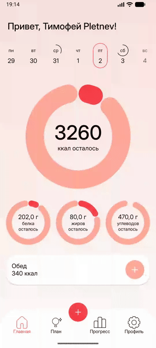
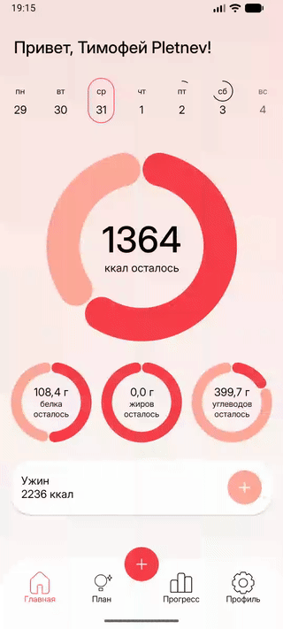

<div align="center">

# 🍎 CalorAI Mobile


**Мобильное приложение для отслеживания калорий и питания с искусственным интеллектом**

[](https://kotlinlang.org/)
[](https://www.android.com/)
[](https://developer.android.com/jetpack/compose)
[](LICENSE)

</div>

---

## 📱 О приложении

**CalorAI** — это современное Android-приложение для отслеживания питания и калорий. Приложение помогает пользователям контролировать свой рацион, отслеживать потребление макронутриентов (белки, жиры, углеводы) и достигать своих целей в области здоровья и фитнеса.

### ✨ Основные возможности

- 🔐 **Авторизация и регистрация** — вход через email/пароль или Google аккаунт
- 📊 **Главный экран** — отслеживание калорий и макронутриентов за день с визуализацией в виде круговых диаграмм
- 🍽️ **Управление приемами пищи** — добавление продуктов вручную (завтрак, обед, ужин, перекус)
- 📅 **Недельный календарь** — просмотр прогресса за разные дни недели
- 👤 **Профиль пользователя** — настройка личных данных, целей и параметров
- 📈 **Отслеживание прогресса** — визуализация достижений
- 📋 **План питания** — планирование рациона

### 🎥 Демонстрация

<table>
  <tr>
    <td align="center">
      <strong>Авторизация</strong><br/>
      
    </td>
    <td align="center">
      <strong>Регистрация</strong><br/>
      
    </td>
  </tr>
  <tr>
    <td align="center">
      <strong>Добавление приема пищи (с нуля)</strong><br/>
      
    </td>
    <td align="center">
      <strong>Добавление к существующему приему</strong><br/>
      
    </td>
  </tr>
  <tr>
    <td align="center" colspan="2">
      <strong>Редактирование профиля</strong><br/>
      
    </td>
  </tr>
</table>

---

## 🛠 Технологический стек

### Языки и платформа
- **Kotlin** 2.2.21
- **Android SDK** (Min: 26, Target: 36)

### UI
- **Jetpack Compose** 2025.11.00 — современный декларативный UI фреймворк
- **Material 3** — компоненты дизайн-системы
- **Coil** 2.7.0 — загрузка изображений

### Архитектура и DI
- **Clean Architecture** — разделение на слои (Domain, Data, UI)
- **MVVM** (Model-View-ViewModel) — паттерн представления
- **Koin** 4.1.1 — dependency injection

### Сетевое взаимодействие
- **Retrofit** 3.0.0 — HTTP клиент
- **Kotlinx Serialization** 1.9.0 — сериализация JSON
- **OkHttp** 5.3.0 — сетевой клиент

### Локальное хранилище
- **Room** 2.8.4 — база данных SQLite
- **Security Crypto** 1.1.0 — безопасное хранение токенов

### Навигация
- **Navigation Compose** 2.9.6 — навигация в Compose

### Разработка
- **KSP** (Kotlin Symbol Processing) — обработка аннотаций
- **Gradle** 8.13.0 — система сборки

---

## 🏗 Архитектура

Приложение построено на основе **Clean Architecture** с разделением на три основных слоя:

### Структура проекта

```
app/src/main/java/dev/calorai/mobile/
├── core/                    # Общие компоненты
│   ├── di/                  # Модули зависимостей (core)
│   ├── local/               # Локальное хранилище (Room, Device ID)
│   ├── navigation/          # Навигация между экранами
│   ├── network/             # Сетевой слой (Retrofit, Interceptors)
│   ├── uikit/               # Переиспользуемые UI компоненты
│   └── utils/               # Утилиты
│
├── features/                # Функциональные модули
│   ├── auth/                # Авторизация
│   │   ├── data/            # Data слой (API, Repository, DTO)
│   │   ├── domain/          # Domain слой (UseCases, Models)
│   │   ├── login/           # UI слой (Login экран)
│   │   └── signUp/          # UI слой (SignUp экран)
│   ├── home/                # Главный экран
│   ├── meal/                # Управление приемами пищи
│   ├── profile/             # Профиль пользователя
│   ├── plan/                # План питания
│   ├── progress/            # Прогресс
│   ├── onboarding/          # Онбординг
│   └── splash/              # Экран загрузки
│
├── di/                      # Главный DI модуль
└── CalorAiApp.kt            # Application класс
```

### Слои архитектуры

#### 1. **Presentation Layer (UI)**
- **Компоненты**: Compose UI, ViewModels, UiState, UiEvent, UiAction
- **Ответственность**: Отображение данных пользователю, обработка пользовательского ввода
- **Паттерн**: MVVM с StateFlow/Flow для реактивности

#### 2. **Domain Layer**
- **Компоненты**: UseCases, Domain Models, Repository Interfaces
- **Ответственность**: Бизнес-логика приложения, независимость от фреймворков
- **Паттерн**: Clean Architecture принципы

#### 3. **Data Layer**
- **Компоненты**: API клиенты (Retrofit), Room DAO, Repository Implementations, Mappers
- **Ответственность**: Получение данных из сети/БД, кэширование, маппинг данных
- **Паттерн**: Repository Pattern

### Dependency Injection

Используется **Koin** для управления зависимостями:
- Модульная структура (coreModules, featureModules)
- Внедрение зависимостей через конструкторы
- ViewModels создаются через `koinViewModel()`

### Навигация

- **Navigation Compose** для навигации между экранами
- Кастомный Router для type-safe навигации
- Разделение на Global и Feature роутеры

---

## 🚀 Установка и настройка

### Требования

- **Android Studio** Hedgehog (2023.1.1) или новее
- **JDK** 11 или выше
- **Android SDK** с API Level 26+
- **Gradle** 8.13.0+

### Шаги установки

1. **Клонирование репозитория**
   ```bash
   git clone https://github.com/yourusername/calorai-mobile.git
   cd calorai-mobile
   ```

2. **Открытие проекта**
   - Откройте Android Studio
   - Выберите `File → Open` и выберите папку проекта
   - Дождитесь синхронизации Gradle

3. **Настройка keystore (для release сборки)**
   
   Создайте файл `keystore.properties` в корне проекта:
   ```properties
   storeFile=path/to/keystore.jks
   storePassword=your_store_password
   keyAlias=your_key_alias
   keyPassword=your_key_password
   ```

4. **Настройка API endpoints**
   
   В файле `app/build.gradle.kts` настройте `BASE_URL`:
   ```kotlin
   buildConfigField(
       "String",
       "BASE_URL",
       "\"https://your-api-url.com/api/\""
   )
   ```

5. **Сборка проекта**
   ```bash
   ./gradlew assembleDebug
   ```
6. **Запуск на эмуляторе/устройстве**
   - Подключите Android устройство или запустите эмулятор
   - Нажмите `Run` в Android Studio или выполните:
   ```bash
   ./gradlew installDebug
   ```
---

## 📦 Структура зависимостей

Основные библиотеки и их версии можно найти в файле `gradle/libs.versions.toml`.

Ключевые зависимости:
- **AndroidX Core KTX** 1.17.0
- **Lifecycle Runtime KTX** 2.9.4
- **Activity Compose** 1.11.0
- **Compose BOM** 2025.11.00
- **Navigation Compose** 2.9.6
- **Room** 2.8.4
- **Retrofit** 3.0.0
- **Koin** 4.1.1

---

## 📄 Лицензия

Этот проект распространяется под лицензией MIT. См. файл [LICENSE](LICENSE) для подробностей.

---

<div align="center">

**Сделано с ❤️ для здоровья и фитнеса**

</div>
